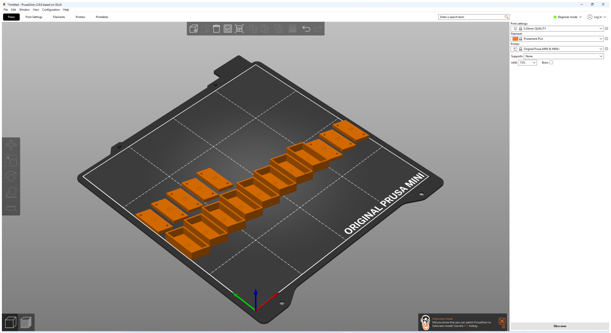

# Assembly Guide

How to assemble a Visit brand icon from its printed pieces.

**Status:** Prototype. The assembly concept is defined and the part numbering is implemented; no physical assembly has been completed yet.

## What you have

After printing a kit you have two kinds of pieces:

- **Front caps** — hollow translucent pieces, marked with a part number on the inside face.
- **Backplates** — small flat pieces with two holes, marked with the same part number on the top face.

Caps and backplates with the same engraved number belong together. Duplicate numbers mean duplicate copies of the same part design — any matching copy works.

  

## The legend

- `analysis/runs/snapfit/part-backplate-v1/universal-single-icon-fixture-legend.svg` shows every part number, its shape, and which icon positions use it.
- `universal-single-icon-fixture-legend.json` is the machine-readable version of the same map.

Use the legend when a kit contains more parts than the icon you are building.

## Assembly on the wall

The icon is assembled directly on the wall:

1. **Mount the backplates first.** For each part position in the icon layout, pin the matching backplate to the wall through its two holes. Position parts using the reference layout in the legend.
2. **Orient the backplates.** The two holes define the orientation; rotate each backplate so its shape matches the intended part orientation.
3. **Snap the caps on.** Press each front cap over its backplate until it seats. The cap is hollow and covers the backplate completely.

## Assembly on a desk (test fit before mounting)

1. Lay the backplates out in the icon arrangement on a table.
2. Snap the caps onto the backplates to check the full icon before committing to the wall.
3. Fix any misordered parts before pinning.

## Order of operations tips

- Build in groups: mount all backplates for a region first, then snap its caps.
- Keep the legend next to you; the engraved numbers are small.
- If a cap resists, check that the number matches before forcing it — a wrong pair can fit partway and jam.

## Troubleshooting

| Problem | Cause | Fix |
| --- | --- | --- |
| Cap won't go on | Wrong part number, or clearance too tight | Check number; regenerate kit with a larger `--fit-clearance-mm` |
| Cap falls off | Clearance too loose | Regenerate with a smaller clearance; test with the coupon kit |
| Part orientation looks wrong | Backplate mounted rotated | Remove pins, rotate to match legend, re-pin |
| Cap cracked | Too-tight fit or brittle material | Reprint with coupon-tested clearance; consider PETG for toughness |
| A piece is missing | Incomplete print or wrong kit | Check the kit manifest; reprint the plate containing that part number |
